# Clinic Management System
A Windows Forms application in C# for managing clinic patients, doctors, and appointments.

---

## 📌 Description
A three-tier system for managing doctors, patients, and clinic applications, with a separate Data Access Layer, Business Logic Layer, and UI, backed by a SQL Server database.

---

## 🛠️ Technologies
- C#
- Windows Forms (WinForms)
- .NET Framework
- SQL Server
- Three-Tier Architecture (DAL / BLL / UI)

---

## 🎯 Features
- Doctor and patient management
- Clinic application handling
- User login and password management
- Multi-layered architecture (DAL, BLL, UI)
- Data validation and error handling

---

## 📷 Preview

  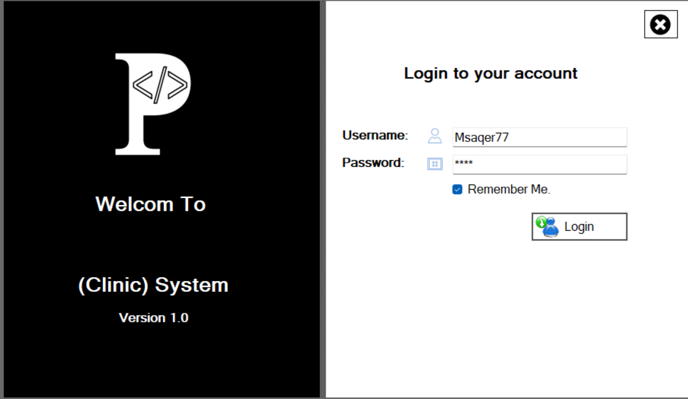
  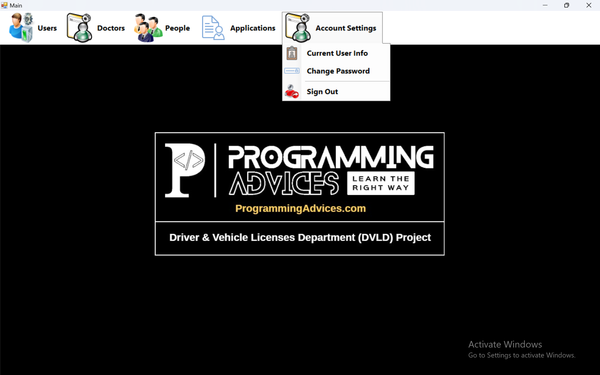
  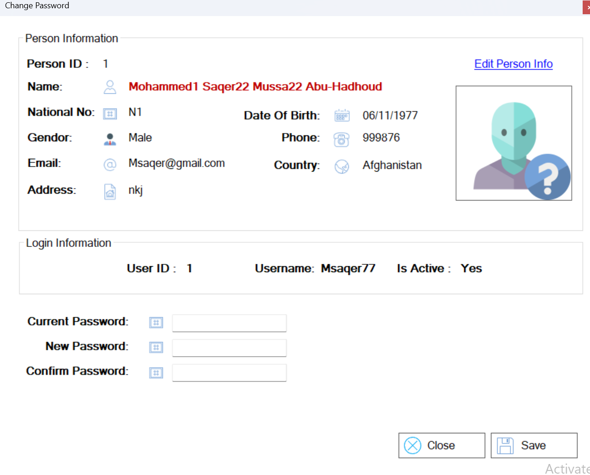

  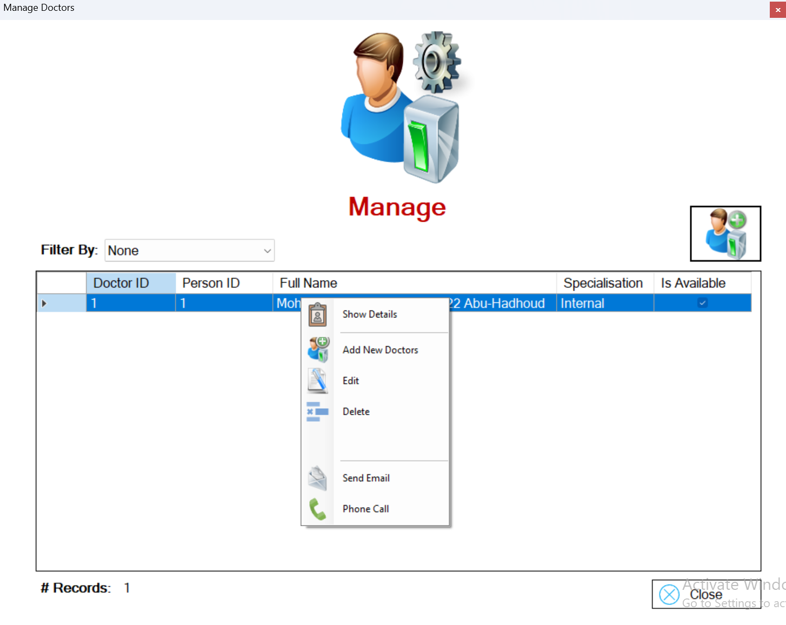
  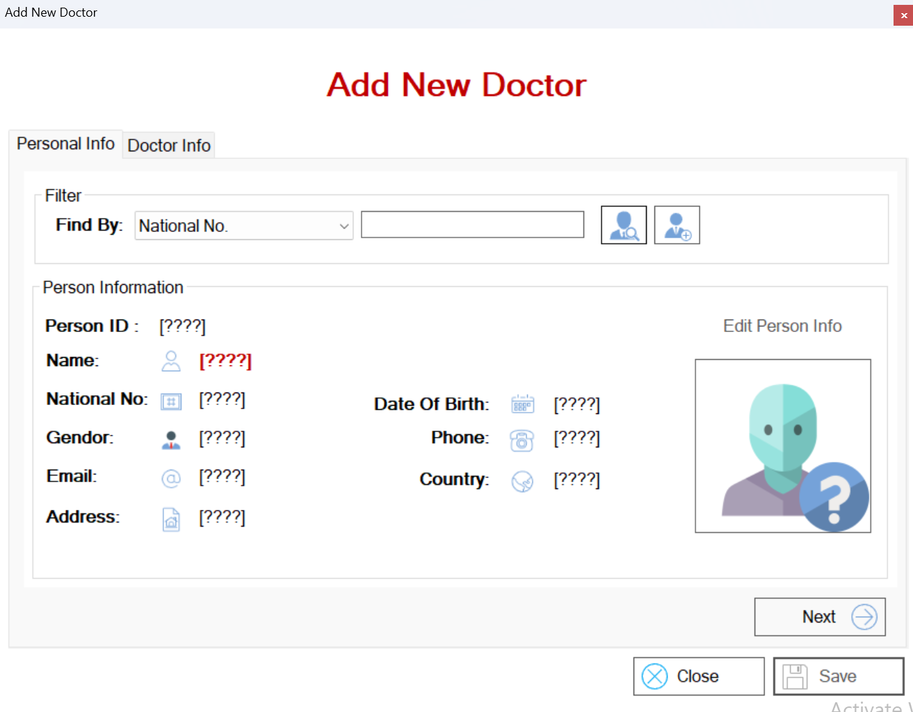
  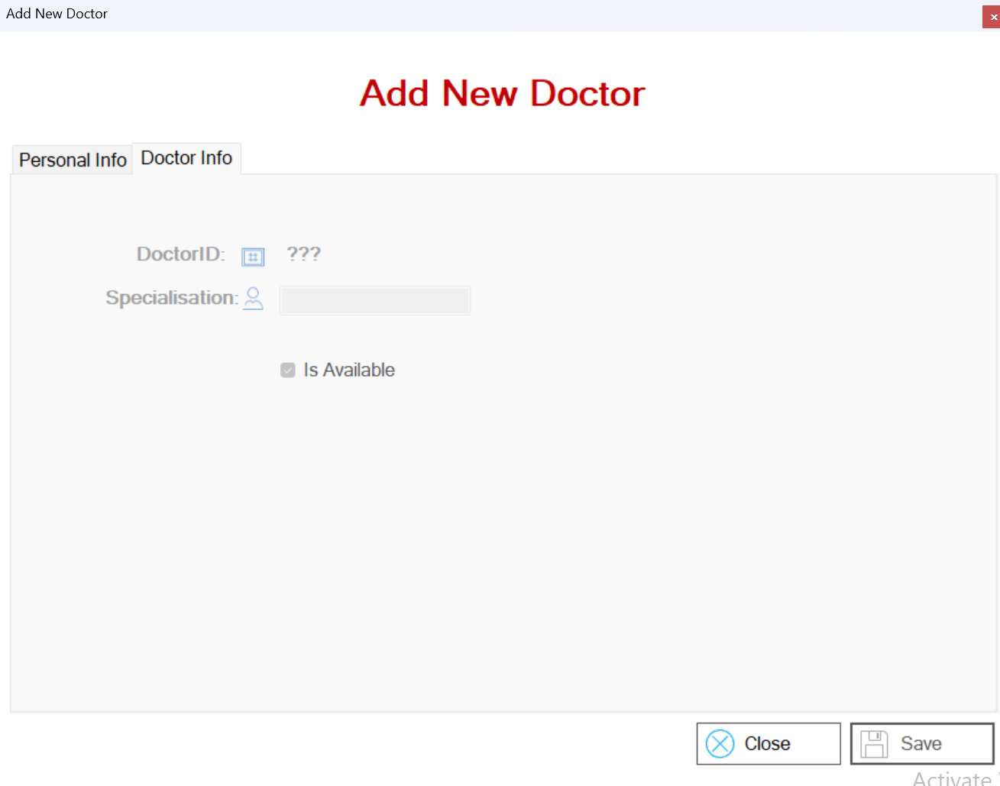

  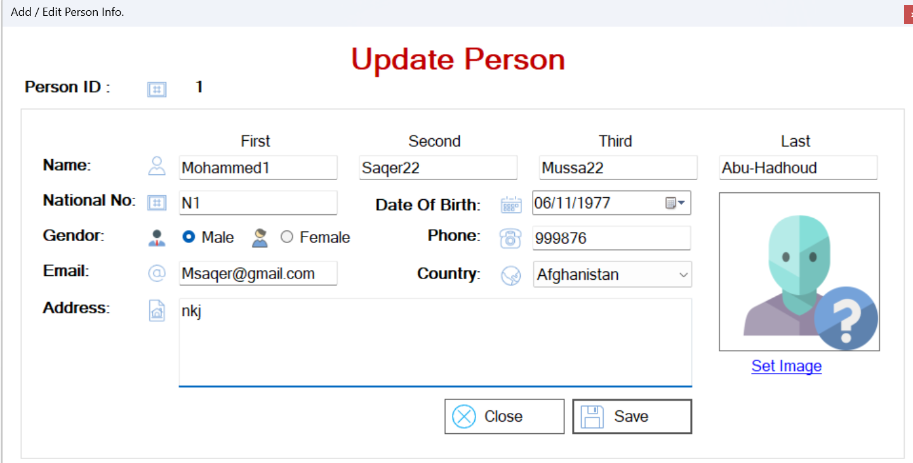
  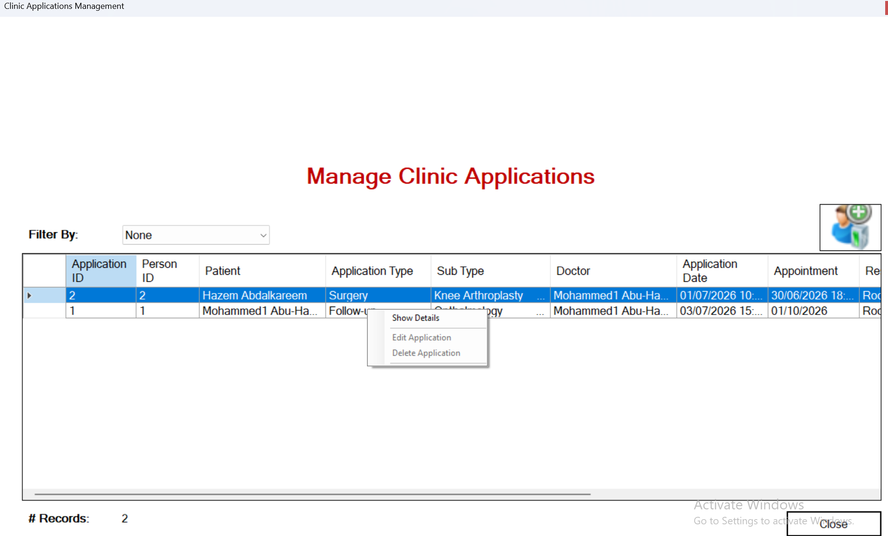
  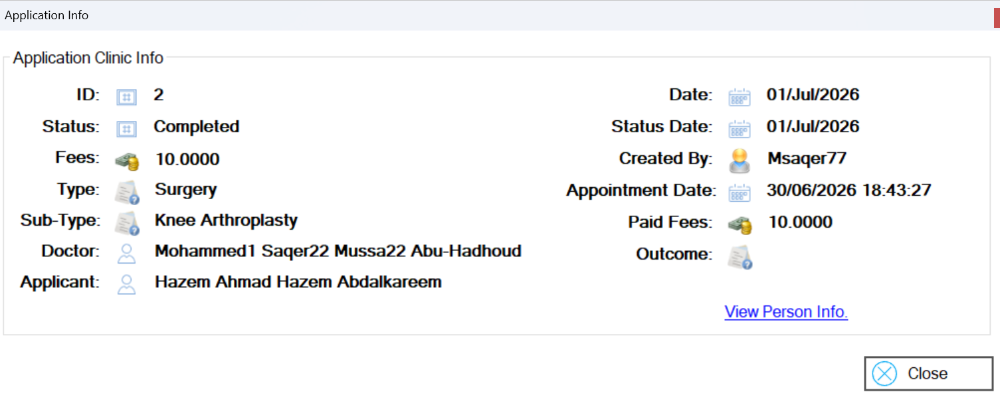

  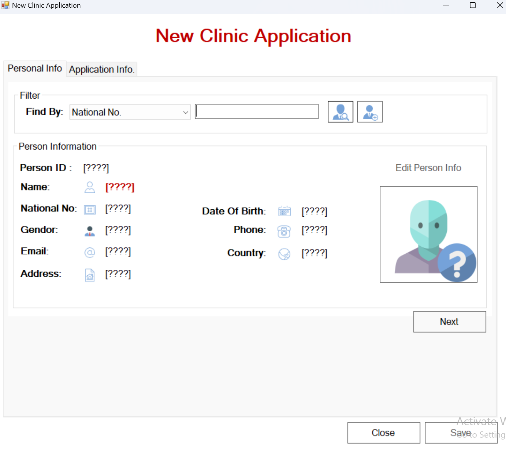
  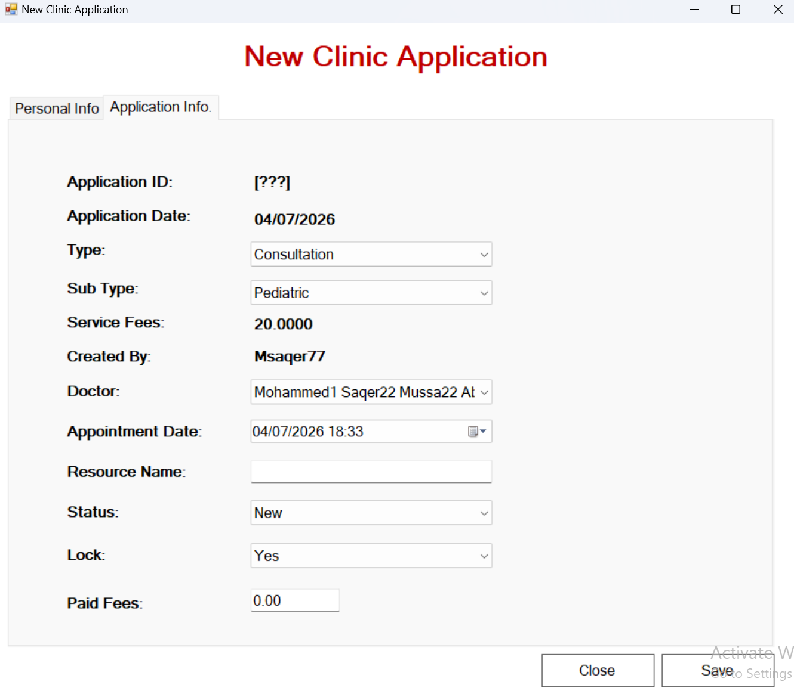

---

## ✍️ Author
Hazem Ahmad Hazem  
- GitHub: https://github.com/HazemAhmadHaz
- LinkedIn: https://www.linkedin.com/in/hazem-ahmad-haz
- Email: HazemAhmad01234@gmail.com
